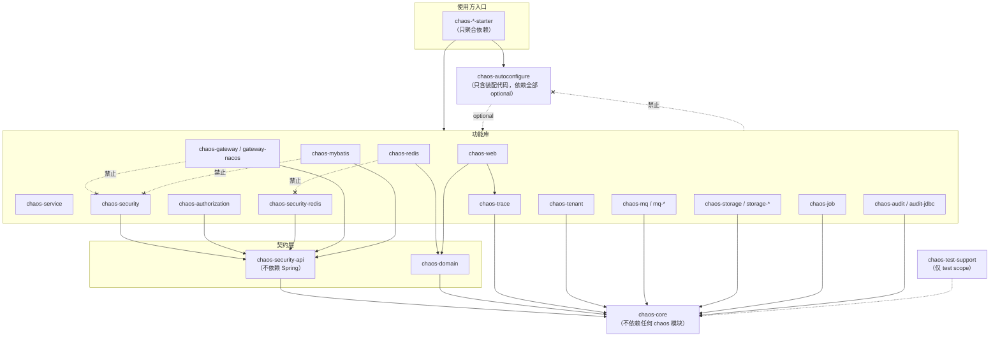

# chaos-framework Architecture

Documentation index: [index.md](index.md).

## 1. Maven Tree

目录按能力域分组，目录名与发布的 artifactId 保持一致（聚合目录本身的 artifactId 为 `*-parent`）。

```text
chaos-framework
├── pom.xml                           chaos-parent：构建插件、质量门禁、发布 profile（parent 为 chaos-dependencies）
├── chaos-dependencies                公共 BOM，也是全部依赖版本的唯一来源（无 parent）
├── chaos-foundation
│   ├── chaos-core                    请求上下文、错误码、异常、幂等/锁/限流 SPI、可信代理 IP 解析（不依赖任何 chaos 模块）
│   └── chaos-domain                  DDD 基础类型（domain.model）、分页（domain.dto）、缓存 key 策略（domain.cache）
├── chaos-observability
│   └── chaos-trace                   W3C trace 上下文、MDC 与日志模板、Feign 透传、Micrometer 指标约定（trace.monitor）
├── chaos-audit
│   ├── chaos-audit                   审计事件端口与日志发布器
│   └── chaos-audit-jdbc              JDBC 审计持久化
├── chaos-tenant                      租户生命周期、隔离契约与 servlet 适配
├── chaos-security
│   ├── chaos-security-api            与 Spring Security 无关的安全契约（LoginUser、claims、撤销/数据权限 SPI、RBAC/ABAC 模型）
│   ├── chaos-security                Servlet 资源服务器、权限/数据权限切面
│   ├── chaos-authorization           OAuth2 授权服务器扩展
│   └── chaos-security-redis          Redis 版 JWT 黑名单与授权服务器存储
├── chaos-web                         Servlet 层：Result、异常、Trace/XSS 过滤器、限流、幂等
├── chaos-service                     应用层：事务、重试、领域事件、上下文 TaskDecorator
├── chaos-data
│   ├── chaos-mybatis                 MyBatis-Plus 租户/数据权限/审计填充
│   └── chaos-redis                   Redisson 锁、幂等仓储、限流、布隆过滤器、延迟队列
├── chaos-mq
│   ├── chaos-mq                      消息与可靠投递（outbox）契约
│   ├── chaos-mq-jdbc                 JDBC outbox 仓储
│   ├── chaos-mq-kafka                Kafka 发布适配
│   └── chaos-mq-rocketmq             RocketMQ 发布适配
├── chaos-gateway
│   ├── chaos-gateway                 网关过滤器（只依赖 chaos-security-api）
│   └── chaos-gateway-nacos           Nacos 动态路由
├── chaos-job                         分布式任务执行（DistributedJobRunner）
├── chaos-storage
│   ├── chaos-storage                 对象存储端口（com.michael.chaos.storage）
│   ├── chaos-storage-oss             阿里云 OSS 适配
│   └── chaos-storage-minio           MinIO 适配
├── chaos-autoconfigure               全部自动装配（com.michael.chaos.autoconfigure.<feature>）与生产安全检查；依赖均为 optional
├── chaos-boot-parent                 业务应用推荐 parent（继承 BOM；编译、测试、repackage 约定；不含框架治理插件）
├── chaos-starters
│   ├── 场景 starter                  chaos-web-service-starter、chaos-gateway-starter、chaos-auth-server-starter（一个应用选一个）
│   └── 能力 starter                  application（原 service）, audit, audit-jdbc, authorization, cloud, cloud-nacos,
│                                     cloud-reactive, gateway-nacos, job, mq, mybatis, redis, security, storage, tenant, web
├── chaos-archetypes                  项目脚手架：chaos-archetype-web-service / -gateway / -auth-server（发布，不进 BOM）
├── chaos-test-support                业务项目测试支持：上下文夹具、LoginUser/MockMvc、内存 RedisTemplate、Testcontainers（test scope 引入）
├── chaos-architecture-tests          仓库级架构测试与依赖方向规则（不发布）
├── chaos-examples                    example-auth-server / example-order-service / example-gateway（不发布）
├── chaos-docs                        Markdown 文档（不发布）
└── chaos-python/chaos-tracing        Python 服务使用的 W3C trace / gRPC 拦截器（独立 pip 包，不参与 Maven 构建）
```

### 1.1 依赖方向规则

下图是模块依赖方向（箭头表示“依赖”，只画关键边）。规则由
`chaos-architecture-tests` 的 `DependencyDirectionArchitectureTest` 与 `LayerBoundaryArchitectureTest` 在 `./mvnw test` 阶段强制执行，
违反时测试失败并指出具体模块、文件与 import。



| # | 规则 | 校验 |
| --- | --- | --- |
| 1 | `chaos-core` 不依赖任何 chaos 模块，不依赖 Spring Web / Servlet / Security | `coreShouldNotDependOnOtherModulesOrWebFrameworks` |
| 2 | `chaos-security-api` 只依赖 `chaos-core`，不引用 `org.springframework.*` | `securityApiShouldOnlyDependOnCore` |
| 3 | `chaos-gateway`、`chaos-gateway-nacos`、`chaos-mybatis`、`chaos-redis` 只能依赖 `chaos-security-api`，不得依赖或 import `chaos-security` / `chaos-authorization` / `chaos-security-redis` | `infrastructureModulesShouldOnlyDependOnSecurityApi` |
| 4 | `chaos-redis` 不含安全领域概念（依赖、import、类名），Redis 版安全实现只在 `chaos-security-redis` | `redisShouldNotContainSecurityConcepts` |
| 5 | `@AutoConfiguration` 与 `AutoConfiguration.imports` 只在 `chaos-autoconfigure`；该模块不含 Filter / Interceptor / Repository / Service / Store / Registry 等实现 | `autoConfigurationShouldLiveInSingleModuleWithBoot3Imports`、`autoconfigureShouldOnlyContainWiring` |
| 6 | starter 不含 Java 代码，不依赖示例、测试支持和架构测试模块 | `startersShouldOnlyAggregateDependencies`、`startersShouldNotDependOnExamplesOrTestModules` |
| 7 | 只有 starter 可以依赖 `chaos-autoconfigure`，库模块与示例不得依赖 | `autoConfigurationShouldLiveInSingleModuleWithBoot3Imports` |
| 8 | `chaos-test-support` 只能以 test scope 被依赖 | `testSupportShouldOnlyBeUsedInTestScope` |
| 9 | 每个模块的 Java 包位于基础包 `com.michael.chaos.<module>` 下，且不落入其他模块更具体的基础包；新增模块须在规则表中登记基础包 | `packagesShouldMatchModuleBasePackage` |
| 10 | 场景 starter（`chaos-web-service-starter`、`chaos-auth-server-starter`）只聚合能力 starter（外加 Actuator / Prometheus）；能力 starter 不得依赖场景 starter | `scenarioStartersShouldOnlyAggregateCapabilityStarters` |

规则基于 POM 解析与源码 import 扫描，而不是 ArchUnit 字节码导入：架构测试模块不依赖业务模块，单独运行
`./mvnw -pl chaos-architecture-tests test` 或并行构建时也能稳定执行，模块级的 optional / test scope 也只有 POM 能准确表达。

历史文档中出现过的 `chaos-cache`、`chaos-lock`、`chaos-idempotent`、`chaos-feign`、`chaos-nacos`、`chaos-log`、`chaos-iam`
并不是独立模块：

| 历史名称 | 实际位置 |
| --- | --- |
| chaos-cache | `chaos-domain` 的 `com.michael.chaos.domain.cache` |
| chaos-lock | 契约在 `chaos-core` 的 `com.michael.chaos.core.lock`，Redisson 实现在 `chaos-redis` |
| chaos-idempotent | 契约在 `chaos-core` 的 `com.michael.chaos.core.idempotent`，Redis 实现在 `chaos-redis`，`@Idempotent` 注解、key 生成与拦截器在 `chaos-web` |
| chaos-feign | `chaos-trace` 的 `com.michael.chaos.trace.feign.TraceFeignRequestInterceptor`，由 `chaos-autoconfigure`（cloud）注册，通过 `chaos-cloud-starter` 引入 |
| chaos-nacos | `chaos-autoconfigure`（cloud.nacos） / `chaos-cloud-nacos-starter`；网关动态路由见 `chaos-gateway-nacos` |
| chaos-log | `chaos-trace` 的 `com.michael.chaos.trace.log`（`MdcKeys`、`MdcSupport`、日志模板） |
| chaos-iam | 未落地，仓库中不存在 |

## 2. Module Responsibilities

| Module | Responsibility |
| --- | --- |
| chaos-dependencies | Public BOM and single source of truth for all dependency versions. |
| chaos-foundation/chaos-core | Minimal constants, request context, exception contracts, idempotency/lock/rate-limit SPIs and trusted-proxy client IP resolution. Depends on no chaos module. |
| chaos-foundation/chaos-domain | DDD aggregate and domain event abstractions (`domain.model`), page model (`domain.dto`) and cache key strategy (`domain.cache`). |
| chaos-observability/chaos-trace | Trace context, W3C Trace Context compatibility, baggage, propagation headers, MDC keys and logging templates, OpenFeign trace interceptor, Micrometer observation filter and meter names. |
| chaos-audit/chaos-audit | Audit event model and default structured audit log publisher. |
| chaos-audit/chaos-audit-jdbc | JDBC audit persistence adapter. |
| chaos-tenant | Tenant lifecycle status, plan and isolation contracts, servlet access filter. |
| chaos-security/chaos-security-api | Spring-Security-free contracts: LoginUser, JWT claims, revocation SPI, data scope SPI, RBAC/ABAC model. |
| chaos-security/chaos-security | Servlet resource server: SecurityUtils, RBAC and data scope aspects, JWT/opaque token conversion. |
| chaos-security/chaos-authorization | OAuth2 Authorization Server, pluggable grant type login and token customization. |
| chaos-security/chaos-security-redis | Redis JWT blacklist (single implementation shared by auth server, resource servers and gateway) and Redis authorization-server stores. |
| chaos-web | MVC only: Result, exception, validation, trace, OpenAPI, access log, Jackson, rate limit, idempotency, XSS. |
| chaos-service | Application layer utilities: transaction, retry, domain events, async context propagation. |
| chaos-data/chaos-mybatis | MyBatis Plus pagination, audit fill, tenant plugin, data scope, logic delete base entity. |
| chaos-data/chaos-redis | Redisson lock, bloom filter, delay queue, Redis idempotency, cluster rate limit and Lua script support. |
| chaos-mq/chaos-mq | Message envelope, publisher, consumer, idempotent consumer and reliable outbox contracts. |
| chaos-mq/chaos-mq-jdbc | JDBC outbox persistence adapter. |
| chaos-mq/chaos-mq-kafka | Kafka adapter. |
| chaos-mq/chaos-mq-rocketmq | RocketMQ adapter. |
| chaos-gateway/chaos-gateway | Gateway filters for auth, tenant, rate limit, gray, blacklist, access log and trace. |
| chaos-gateway/chaos-gateway-nacos | Optional Nacos Config backed dynamic route repository for Spring Cloud Gateway. |
| chaos-job | Distributed job execution and scheduling conventions. |
| chaos-storage/chaos-storage | Object storage port, argument validation and upload policy. |
| chaos-storage/chaos-storage-oss | Aliyun OSS adapter. |
| chaos-storage/chaos-storage-minio | MinIO adapter. |
| chaos-autoconfigure | All auto-configurations (one package per feature) plus production safety checks; every feature library is optional. |
| chaos-starters/chaos-cloud-* | OpenFeign trace propagation (`chaos-cloud-starter`), reactive load-balanced clients without Feign (`chaos-cloud-reactive-starter`) and Nacos discovery/config conventions (`chaos-cloud-nacos-starter`). |
| chaos-archetypes | Maven archetypes generating ready-to-run web-service, gateway and auth-server projects on `chaos-boot-parent`; verified end to end by `scripts/verify-archetypes.sh`. Not in the BOM. |
| chaos-test-support | Test fixtures for business projects: context extension, LoginUser/MockMvc helpers, in-memory RedisTemplate, Testcontainers property registration, production-safety runner helpers. Test scope only. |
| chaos-architecture-tests | Repository-level architecture governance tests; not published. |
| chaos-python/chaos-tracing | W3C trace context and gRPC interceptors for Python services; built and tested by the CI `python` job. |

## 3. Version Matrix

| Component | Version |
| --- | --- |
| Java | 21 |
| Spring Boot | 3.5.16 |
| Spring Cloud | 2025.0.3 |
| Spring Cloud Alibaba | 2025.0.0.0 |
| Testcontainers | 1.21.4 |

所有版本定义在 `chaos-dependencies/pom.xml`。Spring Cloud 2025.0.x 与 Spring Boot 3.5.x 对齐；如果项目必须停留在 Spring Boot `3.4.x`，需要把 Spring Cloud 改为 `2024.0.x`。

Detailed release rules, BOM governance, starter dependency trees and API compatibility checks are documented in [release-governance.md](release-governance.md).

## 4. Starter Rules

Starters are dependency aggregators only (`chaos-autoconfigure` + feature libraries + third-party frameworks). All auto-configuration lives in the single `chaos-autoconfigure` module and is loaded through one file:

```text
META-INF/spring/org.springframework.boot.autoconfigure.AutoConfiguration.imports
```

`spring.factories` is not used.

## 5. Business Project Structure

```text
order-service
├── order-bootstrap
│   └── src/main/java/com/michael/chaos/order/OrderApplication.java
├── order-adapter
│   ├── web
│   ├── persistence
│   ├── mq
│   └── client
├── order-application
│   ├── command
│   ├── query
│   └── service
├── order-domain
│   ├── model
│   ├── repository
│   ├── service
│   └── event
└── order-infrastructure
    ├── mapper
    ├── repository
    ├── config
    └── gateway
```

Dependency direction:

```text
adapter -> application -> domain
infrastructure -> domain
bootstrap -> adapter + infrastructure + application
domain -> no framework infrastructure
```

## 6. Package Convention

All framework packages start with `com.michael.chaos`. Each module owns exactly one base package
`com.michael.chaos.<module>` (for example `chaos-security-api` → `com.michael.chaos.security.api`,
`chaos-audit-jdbc` → `com.michael.chaos.audit.jdbc`, `chaos-autoconfigure` → `com.michael.chaos.autoconfigure.<feature>`),
so a fully qualified class name tells which artifact to depend on and no package is split across jars.
The mapping is enforced by rule 9 in section 1.2.

Recommended business package:

```text
com.michael.chaos.{boundedContext}
├── bootstrap
├── adapter
│   ├── web
│   ├── persistence
│   ├── mq
│   └── rpc
├── application
│   ├── command
│   ├── query
│   └── service
├── domain
│   ├── model
│   ├── repository
│   ├── event
│   └── service
└── infrastructure
    ├── config
    ├── persistence
    ├── cache
    └── client
```

## 7. Observability

Actuator and Prometheus are enabled by starter dependencies. Business applications should expose:

```yaml
management:
  endpoints:
    web:
      exposure:
        include: health,info,prometheus,metrics
```

Prometheus scrape:

```yaml
scrape_configs:
  - job_name: chaos-services
    metrics_path: /actuator/prometheus
    static_configs:
      - targets: ['example-auth-server:9000', 'example-order-service:8081', 'example-gateway:8080']
```

Grafana should use the Prometheus data source. Recommended dashboards: JVM, Spring Boot, Gateway, Nacos and business SLIs.

## 8. Logging

Required fields:

```text
traceId, spanId, userId, appName, uri, ip, cost
```

Use:

```xml
<include resource="com/michael/chaos/trace/log/logback/logback-json.xml"/>
```

Trace filters populate MDC. Feign and Gateway forward trace headers.

## 9. SkyWalking

Run services with SkyWalking Java agent:

```bash
java -javaagent:/opt/skywalking/agent/skywalking-agent.jar \
  -Dskywalking.agent.service_name=example-order-service \
  -Dskywalking.collector.backend_service=skywalking-oap:11800 \
  -jar example-order-service.jar
```

MDC trace fields remain useful for log search. SkyWalking owns distributed span collection.

## 9.1 OpenTelemetry Compatibility

`chaos-trace` provides a lightweight W3C propagation layer without binding framework code to the OpenTelemetry SDK. Its `trace.monitor` package adds a Micrometer Observation filter for low-cardinality framework and tenant tags. The framework consistently propagates:

```text
X-Trace-Id, X-Span-Id, traceparent, tracestate, baggage, X-User-Id, X-Tenant-Id
```

Web and Gateway prefer W3C `traceparent` when it is present, and fall back to `X-Trace-Id` for legacy callers. Feign and MQ create a new child span id for each outbound call while keeping the same trace id.

Spring Boot applications can enable Micrometer/OpenTelemetry tracing through Boot configuration and dependencies:

```yaml
management:
  tracing:
    enabled: true
    propagation:
      type: w3c
```

When using an OpenTelemetry Java agent or SkyWalking Java agent, the agent still owns real span collection. Chaos keeps HTTP, Feign, MQ and log MDC propagation consistent so logs, metrics and traces can be correlated by trace id.

## 10. Audit

`chaos-audit` defines a framework-level audit event port:

```text
AuditEventPublisher
```

Default implementation writes structured `AUDIT_LOG`. Business systems can replace it with a Spring Bean that persists to database, sends MQ, or forwards to a security audit platform.

`chaos-audit-jdbc-starter` provides optional JDBC persistence. It is disabled by default and only replaces the logging publisher when `chaos.audit.jdbc.enabled=true` and `JdbcOperations` exists.

Built-in audit events:

```text
auth.login.success
auth.login.failure
auth.token.revoke
auth.refresh.success
auth.refresh.replay
auth.session.kickout
security.permission.denied
gateway.auth.denied
gateway.blacklist.denied
gateway.tenant.denied
```

Configuration:

```yaml
chaos:
  audit:
    enabled: true
    jdbc:
      enabled: true
      table-name: chaos_audit_event
      fail-fast: false
      mask-value: "******"
      sensitive-keywords:
        - password
        - token
        - secret
        - credential
        - code
        - authorization
        - cookie
```

Custom publisher:

```java
@Bean
AuditEventPublisher auditEventPublisher(AuditRepository repository) {
    return repository::save;
}
```

JDBC schema:

```text
classpath:db/chaos-audit-schema.sql
```

Sensitive values such as password, verification code, token, cookie and authorization headers must never be written as plaintext audit attributes. The JDBC adapter masks these keys by default; projects can replace `AuditAttributeSanitizer` for stricter compliance.

## 11. Tenant Governance

`chaos-tenant` defines SaaS tenant lifecycle contracts:

```text
TenantStatusProvider
TenantAccessValidator
TenantContext
TenantDescriptor
TenantPlan
TenantIsolationMode
```

Default behavior treats a non-blank tenant ID as `ACTIVE` and missing tenant ID as `UNKNOWN`. Production systems should replace `TenantStatusProvider` with an implementation backed by a tenant center, database or configuration service.

Configuration:

```yaml
chaos:
  tenant:
    enabled: true
    fail-closed: true
    header-name: X-Tenant-Id
    default-isolation-mode: shared_schema
  gateway:
    tenant:
      enabled: true
      fail-closed: true
      header-name: X-Tenant-Id
```

Gateway validates tenant status after JWT authentication and before business routing. Frozen, disabled, expired, deleted or unknown tenants are rejected with 403 in fail-closed mode. MyBatis tenant ID resolution reads `TenantContext` first and falls back to `RequestContext`.

## 12. Reliable MQ

`chaos-mq` defines reliable message contracts without depending on Kafka, RocketMQ or database APIs:

```text
ReliableMessage
ReliableMessageStatus
OutboxMessageRepository
ReliableMessagePublisher
ReliableMessageDispatcher
RetryBackoffStrategy
DeadLetterMessageHandler
MessageSendResultHandler
```

Recommended flow:

1. Business transaction writes business data and outbox message through `ReliableMessagePublisher`.
2. Scheduler loads due messages from `OutboxMessageRepository`.
3. `ReliableMessageDispatcher` sends the message through a concrete `MessagePublisher`.
4. Success marks the message `SENT`; failure moves it to `RETRYING` or `DEAD_LETTER`.
5. `DeadLetterMessageHandler` forwards unrecoverable messages to audit, alerting or manual compensation.

## 13. Enterprise Practices

1. Keep domain modules free from Spring, Redis, MQ and persistence APIs.
2. Put interfaces in domain/application; put adapters in infrastructure.
3. Add a starter only when multiple services need the same dependency policy.
4. Never add a giant util/common bucket.
5. Prefer typed properties and auto-configuration conditions over hard-coded behavior.
6. Keep tenant, gray and observability headers stable across HTTP, Feign and MQ.
7. Use dependency convergence checks before publishing releases.
8. Treat chaos modules as product APIs: document, test and version them.
9. Keep `chaos-architecture-tests` architecture rules green before merging framework changes.

## 14. Integration Tests

Real infrastructure tests are isolated behind the `chaos-integration-test` profile:

```bash
mvn -Pchaos-integration-test verify
```

Coverage:

```text
chaos-redis       -> Redis 7.2: lock, idempotent key, Lua, JWT blacklist
chaos-mybatis     -> MySQL 8.4: tenant SQL rewrite
chaos-mq-kafka    -> Kafka 3.8: trace headers in broker records
```

RocketMQ integration tests should use a separate profile because NameServer and Broker startup are slower and more environment-sensitive.

## 15. Authorization

`chaos-authorization-starter` is based on Spring Authorization Server. It registers custom `grant_type` support through Token Endpoint extension points:

```text
AuthenticationConverter -> ChaosGrantAuthenticationToken
AuthenticationProvider  -> ChaosGrantAuthenticationHandler
```

Default grant types:

```text
password : username + password
sms_code : mobile + code
```

Token endpoint examples:

```bash
curl -u chaos-client:chaos-secret \
  -d 'grant_type=password&username=admin&password=123456&scope=read write' \
  http://localhost:9000/oauth2/token

curl -u chaos-client:chaos-secret \
  -d 'grant_type=sms_code&mobile=13800000000&code=123456&scope=read' \
  http://localhost:9000/oauth2/token
```

Business systems provide user lookup and validation:

```java
@Bean
ChaosAuthorizationUserService authorizationUserService() {
    return new ChaosAuthorizationUserService() {
        @Override
        public LoginUser authenticateByUsername(String username, String password) {
            return new LoginUser("1", username, "tenant-1", Set.of("admin"), Set.of("system:user:list"));
        }

        @Override
        public LoginUser loadByMobile(String mobile) {
            return new LoginUser("1", mobile, "tenant-1", Set.of("user"), Set.of());
        }
    };
}

@Bean
SmsCodeVerifier smsCodeVerifier() {
    return (mobile, code) -> true;
}
```

Custom grant type:

```java
@Bean
ChaosGrantAuthenticationHandler socialGrantHandler() {
    return new ChaosGrantAuthenticationHandler() {
        @Override
        public AuthorizationGrantType grantType() {
            return new AuthorizationGrantType("social");
        }

        @Override
        public LoginUser authenticate(Map<String, Object> parameters) {
            String provider = (String) parameters.get("provider");
            String openId = (String) parameters.get("openId");
            return loadUser(provider, openId);
        }
    };
}
```

The `RegisteredClient` must also allow custom grant types. Use `chaos.authorization.client.store-type=jdbc` for Spring Authorization Server JDBC storage, or override the `RegisteredClientRepository` bean for a custom client center.

Token type configuration:

```yaml
chaos:
  authorization:
    token:
      type: jwt
    client:
      store-type: jdbc
```

`jwt` uses Spring Authorization Server self-contained access tokens. It is stateless for resource servers. Immediate revocation requires resource-server blacklist checks through `JwtRevocationService`, or Redis reference token mode.

Redis token mode:

```yaml
spring:
  data:
    redis:
      host: localhost
      port: 6379

chaos:
  authorization:
    token:
      type: redis
      redis-key-prefix: chaos:authorization
```

`redis` uses Spring Authorization Server reference access tokens and stores `OAuth2Authorization` records in Redis. Resource servers should use opaque token introspection or call the authorization server, so removed tokens fail immediately.

Resource-server opaque token mode:

```yaml
chaos:
  security:
    token:
      type: opaque
    opaque-token:
      introspection-uri: http://auth-server:9000/oauth2/introspect
      client-id: chaos-client
      client-secret: chaos-secret
```

Gateway opaque token mode:

```yaml
chaos:
  gateway:
    token:
      type: opaque
    opaque-token:
      introspection-uri: http://auth-server:9000/oauth2/introspect
      client-id: chaos-client
      client-secret: chaos-secret
```

Kickout:

```yaml
chaos:
  authorization:
    token:
      type: redis
    kickout:
      enabled: true
      scope: client
```

Kickout scopes:

```text
client : same user + same clientId are mutually exclusive
device : same user + same clientId + same deviceId are mutually exclusive
global : same user across all clients are mutually exclusive
```

Kickout is effective across instances in Redis token mode. In JWT mode, already issued self-contained access tokens are rejected immediately only when resource servers enable token introspection or `JwtRevocationService` blacklist checks.
The token request can pass `device_id` as a form parameter or `X-Device-Id` as a header. The authorization server stores device ID, IP, User-Agent and grant type in the authorization session index for audit and troubleshooting.

## 16. Evolution Roadmap

1. Add RocketMQ isolated Testcontainers profile.
2. Add gray release integration with Nacos metadata and Gateway route weights.
3. Add framework BOM release automation and compatibility tests per Spring line.
4. Extend architecture tests from source scanning to bytecode-level ArchUnit when module size grows.
